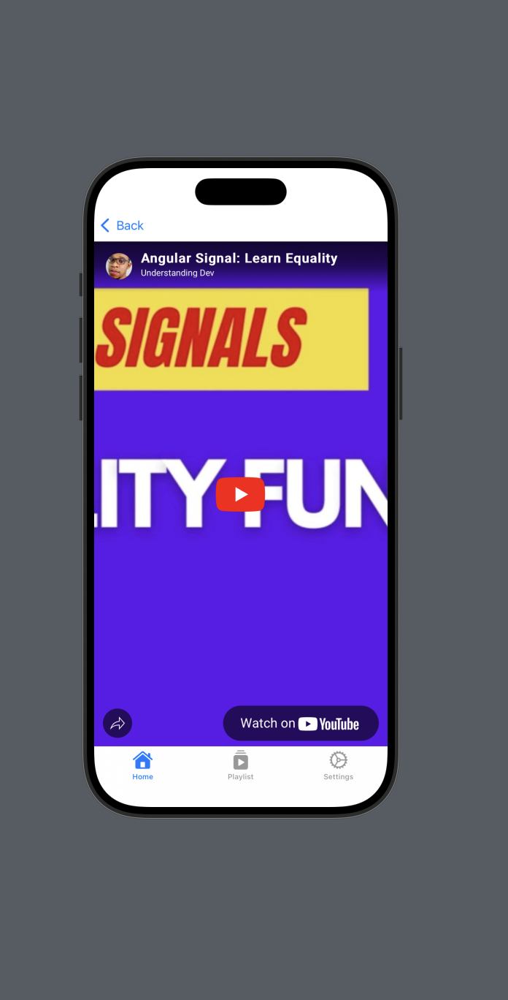

📲 Understanding Dev – SwiftUI App for Your YouTube Channel

Understanding Dev is a SwiftUI-based iOS app that delivers a native mobile experience for viewers of the Understanding Dev YouTube Channel. It organizes your videos, playlists, and settings into a seamless, minimalist interface for learning on the go.

🎯 Features

- ▶️ Video Feed: Watch all your YouTube videos in one place with thumbnails, titles, and tap-to-play support.
- 📂 Playlist View: Grouped video collections make it easy to binge-watch your series-based tutorials.
- ⚙️ Settings Panel: Customizations for app appearance and playback preferences, including future personalization options.
- 🔄 Dynamic Loading (Planned): Ready to integrate YouTube Data API for real-time content updates.
- 🌙 Dark Mode Support: Full support for light and dark appearance, adaptive to system settings.

🧰 Tech Stack

- SwiftUI for building the UI
- MVVM Architecture for separation of concerns
- SwiftData / Local Caching (optional)
- State Management with @StateObject, @ObservedObject, @EnvironmentObject

📌 Use Case
Designed to showcase your YouTube tutorials in a focused, branded experience — especially useful for followers who want a distraction-free learning space.

📸 Screenshots

👨‍💻 Creator
Built by Nnamdi Chidume for the Understanding Dev channel

- 📺 YouTube: [UnderstandingDevChannel](https://m.youtube.com/channel/UCUCHv7YOQXWy2dsL-0IrlPw)
- 💻 GitHub: [UnderstandingDevChannel](https://github.com/philipszdavido/UnderstandingDevChannel)
